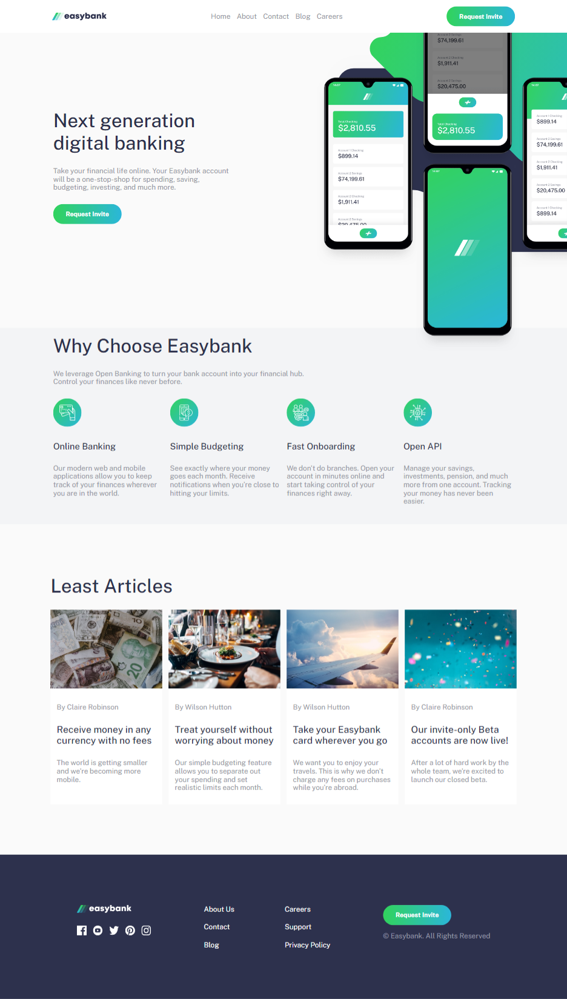

# Frontend Mentor - Easybank landing page solution

This is a solution to the [Easybank landing page challenge on Frontend Mentor](https://www.frontendmentor.io/challenges/easybank-landing-page-WaUhkoDN). Frontend Mentor challenges help you improve your coding skills by building realistic projects.

## Table of contents

- [Overview](#overview)
  - [The challenge](#the-challenge)
  - [Screenshot](#screenshot)
  - [Links](#links)
- [My process](#my-process)
  - [Built with](#built-with)
  - [What I learned](#what-i-learned)
  - [Continued development](#continued-development)
- [Author](#author)

## Overview

### The challenge

Users should be able to:

- View the optimal layout for the site depending on their device's screen size
- See hover states for all interactive elements on the page

### Screenshot

### Links

- Solution URL: [Add solution URL here]()
- Live Site URL: [Add live site URL here](https://stirring-starlight-ece270.netlify.app/)

## My process

### Built with

- Semantic HTML5 markup
- Flexbox
- CSS Grid
- [SCSS](https://sass-lang.com/) - For Styles
- [React](https://reactjs.org/) - JS library
- [Next.js](https://vitejs.dev/) - Vite framework

### What I learned

This is the second time I’ve ventured into SCSS. It was difficult because I’ve been working with TailwindCSS for a while. I used some basic features of SCSS like `@mixins`, `@include,` and `@use`. I made all the styles as modules, though I’m not sure if that was the best approach.

I also used variables for design elements like colors, sizes, and fonts, and I think it was a good idea.

The most difficult part was positioning SVG backgrounds at the top of the page. However, I learned a lot from it. I used `position: relative` and `overflow-x: clip` to crop the overlap, while positioning the SVGs with `position: absolute`.

Another issue I faced during development was styles being applied to tags I didn’t intend. The solution was to use class names instead of their literal tag names. For example, I changed header to `.header`, which solved the problem.

### Continued development

I know that many devs don’t particularly like TailwindCSS, and I need to learn more about SCSS as an additional development tool.

## Author

- Frontend Mentor - [@jlramossoares](https://www.frontendmentor.io/profile/JLSoaresRamos)
- Linkedin - [@jlramossoares](https://www.linkedin.com/in/jlramossoares/)
